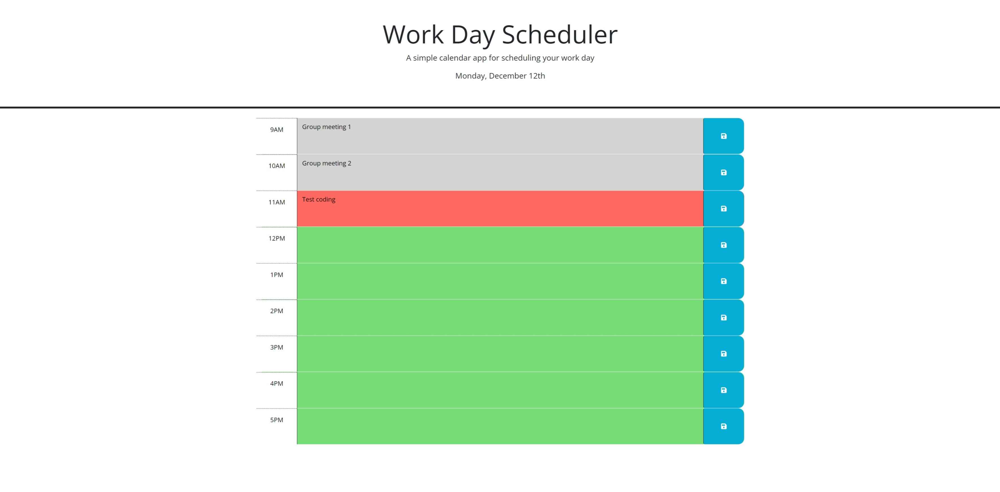

<!-- omit in toc -->
# jQuery Work Day Scheduler

<!-- omit in toc -->
## Description

This is a simple calendar app powered by jQuery that allows a user to save events for each hour of the day. The current day is displayed at the top of the calendar, and each time block is color-coded to indicate whether it is in the past, present, or future. User can enter an event into a time block and save it in local storage, which will persist on page load.
 
 
You can check out the deployed application from the link below:
 
[https://clairehwcho.github.io/jquery-workday-scheduler/](https://clairehwcho.github.io/jquery-workday-scheduler/)

<!-- omit in toc -->
## Table of Contents
- [Installation](#installation)
- [Screenshots](#screenshots)
- [License](#license)

## Installation

No special requirements.

## Screenshots

- Index page with the current day at the top of the calendar and time blocks that are color-coded for its hour

- Save event by entering into the time block.

## License
Copyright © 2022 [Claire Cho](https://github.com/clairehwcho).